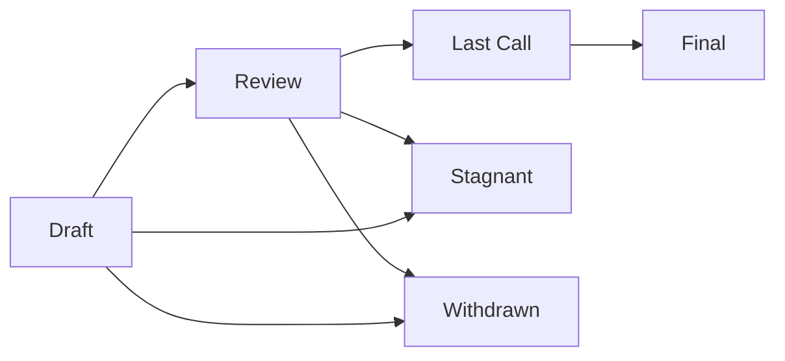

## Короткий ответ

EIP (Ethereum Improvement Proposal) - это стандартизированный формат документов для предложения изменений в протоколе Ethereum. EIP описывает любые существенные изменения в протоколе, включая улучшения основного протокола, клиентских API, стандартов смарт-контрактов и т.д.

---

## Подробный разбор

### **Структура EIP**

1. **Обязательные компоненты:**
   - Преамбула (метаданные)
   - Абстрактное описание
   - Спецификация
   - Обоснование
   - Реализация (если применимо)

2. **Пример преамбулы:**
   ```yaml
   EIP: <номер EIP>
   Title: <название EIP>
   Author: <автор(ы)>
   Type: <Standards Track | Informational | Meta>
   Category: <Core | Networking | Interface | ERC>
   Status: <Draft | Review | Last Call | Final | Stagnant | Withdrawn>
   Created: <дата создания>
   Requires: <зависимые EIP> (опционально)
   ```

### **Категории EIP**

1. **Standards Track:**
   - **Core:** Изменения консенсуса, требующие хард-форка
   - **Networking:** Изменения в p2p протоколе и devp2p
   - **Interface:** Изменения в API/RPC спецификациях
   - **ERC:** Стандарты на уровне приложений

2. **Informational:**
   - Общие рекомендации
   - Руководства по дизайну
   - Информационные материалы

3. **Meta:**
   - Процессы вокруг Ethereum
   - Изменения в процессах
   - Изменения в инструментах

### **Жизненный цикл EIP**



1. **Draft:**
   - Начальная стадия
   - Активное обсуждение и изменения
   - Может быть отправлен как PR

2. **Review:**
   - Технический анализ
   - Публичное обсуждение
   - Возможны существенные изменения

3. **Last Call:**
   - Финальное рассмотрение
   - Период 14 дней
   - Только критические изменения

4. **Final:**
   - Утверждённое предложение
   - Не подлежит изменениям
   - Готово к имплементации

### **Технические аспекты создания EIP**

1. **Форматирование:**
   ```markdown
   # EIP-X: Название
   
   ## Abstract
   Краткое техническое описание
   
   ## Specification
   Детальная техническая спецификация
   
   ## Rationale
   Техническое обоснование решений
   ```

2. **Требования к спецификации:**
   - Точные технические детали
   - Исчерпывающее описание
   - Отсутствие неоднозначности
   - Совместимость с существующим кодом

3. **Примеры успешных EIP:**
   ```solidity
   // EIP-20: Token Standard
   interface IERC20 {
       function totalSupply() external view returns (uint256);
       function balanceOf(address account) external view returns (uint256);
       // ... другие функции
   }
   
   // EIP-721: Non-Fungible Token Standard
   interface IERC721 {
       function ownerOf(uint256 tokenId) external view returns (address);
       function transferFrom(address from, address to, uint256 tokenId) external;
       // ... другие функции
   }
   ```

### **Процесс рассмотрения EIP**

1. **Технический анализ:**
   - Проверка спецификации
   - Анализ безопасности
   - Оценка производительности
   - Совместимость

2. **Публичное обсуждение:**
   - GitHub Issues
   - Ethereum Magicians форум
   - Core Dev calls
   - Community calls

---

## Связанные темы
- [[6. Список вопросов]]
- [[Приведите 3-5 примеров популярных EIP и расскажите коротко о чем они?]]
- [[Что такое ERC?]]
- [[Что такое DAO?]]

---

## Источники
- [EIP-1: EIP Purpose and Guidelines](https://eips.ethereum.org/EIPS/eip-1)
- [Ethereum Improvement Proposals](https://eips.ethereum.org/)
- [EIP GitHub Repository](https://github.com/ethereum/EIPs) 