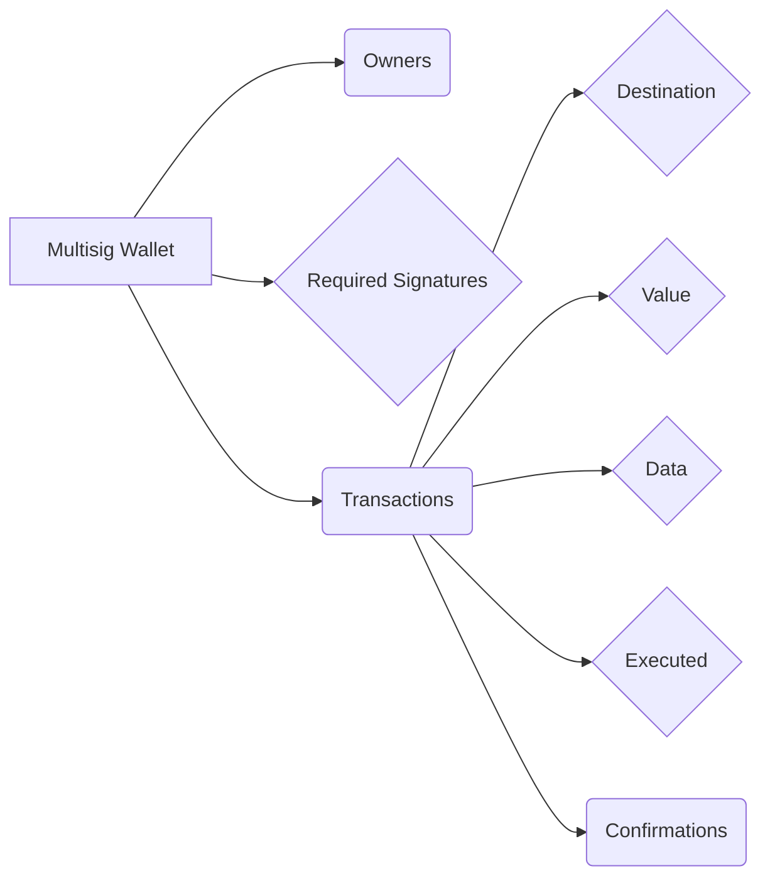
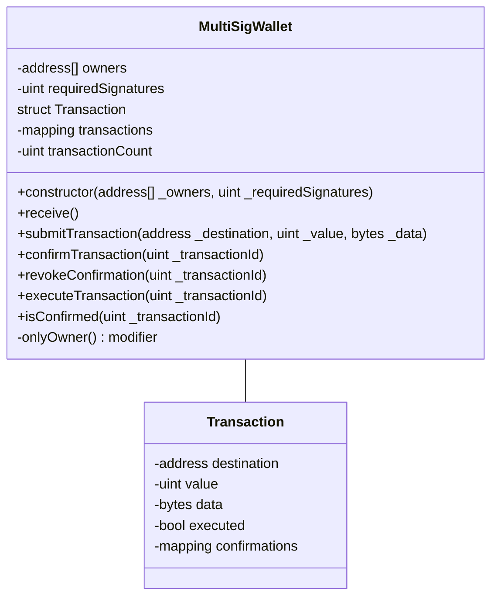

## План разработки Multisig Wallet на Solidity

### **I. Обзор**

* **Цель**: Разработка безопасного и гибкого Multisig Wallet контракта, требующего подтверждения транзакций несколькими владельцами (EOA адресами).
* **Основные функции**:
    * Создание кошелька и регистрация владельцев.
    * Изменение списка владельцев.
    * Предложение транзакций.
    * Подтверждение транзакций владельцами.
    * Отмена транзакций.
    * Исполнение транзакций после достижения необходимого количества подтверждений.


### **II. Исследование и Архитектура**

1. **Исследование существующих решений**:
    * Изучение существующих Multisig Wallet контрактов (например, Gnosis Safe) для выявления лучших практик и потенциальных проблем[^4].
    * Анализ различных подходов к управлению владельцами, хранению транзакций и механизмам подтверждения.
2. **Определение архитектуры контракта**:
    * **Структура данных**:
        * `owners`: Массив адресов владельцев кошелька.
        * `requiredSignatures`: Количество подписей, необходимых для выполнения транзакции.
        * `transactions`:  Сопоставление идентификаторов транзакций со структурой `Transaction`.
        * `Transaction`: Структура, содержащая:
            * `destination`: Адрес получателя.
            * `value`: Сумма перевода (в Wei).
            * `data`: Данные для вызова контракта (bytes).
            * `executed`: Флаг, указывающий, была ли выполнена транзакция.
            * `confirmations`:  Сопоставление адресов владельцев с булевыми значениями, указывающими, подтвердили ли они транзакцию.
    * **Функции**:
        * `constructor`: Инициализация кошелька с указанием списка владельцев и требуемого количества подписей.
        * `addOwner(address newOwner)`: Добавление нового владельца (требует подтверждения от существующих владельцев или определенного порога).
        * `removeOwner(address ownerToRemove)`: Удаление владельца (требует подтверждения).
        * `changeRequirement(uint newRequired)`: Изменение требуемого количества подписей (требует подтверждения).
        * `submitTransaction(address destination, uint value, bytes data)`:  Предложение новой транзакции.
        * `confirmTransaction(uint transactionId)`: Подтверждение транзакции владельцем.
        * `revokeConfirmation(uint transactionId)`: Отмена подтверждения транзакции владельцем[^2].
        * `executeTransaction(uint transactionId)`:  Выполнение транзакции после получения достаточного количества подтверждений[^1].
        * `isConfirmed(uint transactionId)`: Проверка, достаточно ли подтверждений для транзакции[^1].
    * **Схема архитектуры**:



3. **Согласование спорных моментов**:
    * **Механизм изменения списка владельцев**:
        * Требуется ли единогласное одобрение всех владельцев для добавления/удаления?
        * Использовать ли механизм голосования с определенным порогом?
    * **Обработка ошибок и безопасность**:
        * Как предотвратить повторное выполнение транзакций?
        * Как защититься от атак типа "отказ в обслуживании" (DoS)?
        * Как обрабатывать случаи, когда выполнение транзакции приводит к ошибке?
    * **Модификаторы**:
        * `onlyOwner`: Модификатор, ограничивающий доступ к функциям только для владельцев.
    * **События (Events)**:
        * `Deposit`:  Событие, генерируемое при получении средств кошельком[^2].
        * `SubmitTransaction`: Событие, генерируемое при предложении новой транзакции[^2].
        * `ConfirmTransaction`: Событие, генерируемое при подтверждении транзакции.
        * `RevokeConfirmation`: Событие, генерируемое при отмене подтверждения.
        * `ExecuteTransaction`: Событие, генерируемое при выполнении транзакции.

### **III. Разработка контракта**

1. **Структура контракта**: [[Основные функции]]

```solidity
// SPDX-License-Identifier: MIT
pragma solidity ^0.8.9;

contract MultiSigWallet {

    address[] public owners;
    uint public requiredSignatures;

    struct Transaction {
        address payable destination;
        uint value;
        bytes data;
        bool executed;
        mapping(address => bool) public confirmations;
    }

    mapping(uint => Transaction) public transactions;
    uint public transactionCount;

    event Deposit(address indexed sender, uint value);
    event SubmitTransaction(uint indexed transactionId, address destination, uint value, bytes data);
    event ConfirmTransaction(uint indexed transactionId, address indexed owner);
    event RevokeConfirmation(uint indexed transactionId, address indexed owner);
    event ExecuteTransaction(uint indexed transactionId);

    constructor(address[] memory _owners, uint _requiredSignatures) {
        require(_owners.length > 0, "Owners required");
        require(_requiredSignatures > 0 && _requiredSignatures <= _owners.length, "Invalid required signatures");

        owners = _owners;
        requiredSignatures = _requiredSignatures;
    }

    receive() external payable {
        emit Deposit(msg.sender, msg.value);
    }

    modifier onlyOwner() {
        bool isOwner = false;
        for (uint i = 0; i < owners.length; i++) {
            if (owners[i] == msg.sender) {
                isOwner = true;
                break;
            }
        }
        require(isOwner, "Not owner");
        _;
    }

    function submitTransaction(address payable _destination, uint _value, bytes memory _data) public onlyOwner returns (uint transactionId) {
        transactionId = transactionCount;
        transactions[transactionId] = Transaction({
            destination: _destination,
            value: _value,
            data: _data,
            executed: false
        });
        transactionCount++;
        emit SubmitTransaction(transactionId, _destination, _value, _data);
        return transactionId;
    }

    function confirmTransaction(uint _transactionId) public onlyOwner {
        require(transactions[_transactionId].destination != address(0), "Transaction does not exist");
        require(!transactions[_transactionId].executed, "Transaction already executed");
        require(!transactions[_transactionId].confirmations[msg.sender], "Transaction already confirmed by sender");

        transactions[_transactionId].confirmations[msg.sender] = true;
        emit ConfirmTransaction(_transactionId, msg.sender);
    }

    function revokeConfirmation(uint _transactionId) public onlyOwner {
        require(transactions[_transactionId].destination != address(0), "Transaction does not exist");
        require(!transactions[_transactionId].executed, "Transaction already executed");
        require(transactions[_transactionId].confirmations[msg.sender], "Transaction not confirmed by sender");

        transactions[_transactionId].confirmations[msg.sender] = false;
        emit RevokeConfirmation(_transactionId, msg.sender);
    }

    function executeTransaction(uint _transactionId) public onlyOwner {
        require(transactions[_transactionId].destination != address(0), "Transaction does not exist");
        require(!transactions[_transactionId].executed, "Transaction already executed");
        require(isConfirmed(_transactionId), "Not enough confirmations");

        Transaction storage transaction = transactions[_transactionId];
        transaction.executed = true;

        (bool success, ) = transaction.destination.call{value: transaction.value}(transaction.data);
        require(success, "Transaction failed");

        emit ExecuteTransaction(_transactionId);
    }

    function isConfirmed(uint _transactionId) public view returns (bool) {
        uint confirmationCount = 0;
        for (uint i = 0; i < owners.length; i++) {
            if (transactions[_transactionId].confirmations[owners[i]]) {
                confirmationCount++;
            }
        }
        return confirmationCount >= requiredSignatures;
    }
}
```

2. **Реализация функций**:
    * Реализация каждой функции контракта в соответствии с архитектурным планом.
    * Внедрение модификаторов для контроля доступа.
    * Генерация событий для отслеживания действий.
3. **Безопасность**:
    * Использование `require()` для проверки входных данных и состояний.
    * Защита от переполнения и потери точности (например, использование SafeMath, начиная с Solidity 0.8.0 это уже не требуется).
    * Предотвращение повторного выполнения транзакций.

### **IV. Тестирование**

1. **Написание Unit-тестов**:
    * Использование фреймворков для тестирования, таких как Truffle или Hardhat[^3].
    * Тестирование всех функций контракта, включая позитивные и негативные сценарии.
    * Проверка правильности генерации событий.
2. **Интеграционное тестирование**:
    * Тестирование взаимодействия контракта с другими контрактами (если необходимо).
3. **Аудит безопасности**:
    * Привлечение сторонних аудиторов для выявления потенциальных уязвимостей[^3].

### **V. Развертывание и мониторинг**

1. **Развертывание контракта**:
    * Выбор подходящей сети (тестовая или основная).
    * Проверка параметров при развертывании (например, список владельцев, требуемое количество подписей).
2. **Мониторинг**:
    * Отслеживание событий контракта для обнаружения подозрительной активности.
    * Мониторинг баланса кошелька.

### **VI. Документация**

1. **Подробное описание контракта**:
    * Описание каждой функции, ее параметров и возвращаемых значений.
    * Объяснение логики работы контракта.
2. **Инструкции по использованию**:
    * Примеры использования контракта для выполнения различных задач.
3. **Схема контракта**:




### **VII. Безопасность**

1. **Общие рекомендации**:
    * Использовать проверенные библиотеки, такие как OpenZeppelin[^3].
    * Избегать плавающих версий Solidity[^3].
    * Проводить аудит безопасности[^3].
    * Писать тесты[^3].
2. **Рекомендации для Multisig Wallet**:
    * Внимательно проверять список владельцев при создании кошелька.
    * Использовать достаточное количество подписей для обеспечения безопасности.
    * Регулярно проверять и обновлять список владельцев.

Этот план представляет собой отправную точку для разработки Multisig Wallet контракта.  В процессе разработки могут возникнуть дополнительные требования и изменения, которые необходимо будет учитывать.

<div style="text-align: center">⁂</div>

[^1]: https://coinsbench.com/building-a-multi-signature-wallet-contract-in-solidity-63641eaacd2b

[^2]: https://www.youtube.com/watch?v=8ja72g_Dac4

[^3]: https://dev.to/superxdev/security-best-practices-in-solidity-1p42

[^4]: https://forum.aztec.network/t/ideas-on-account-abstraction/339

[^5]: https://blog.blockmagnates.com/multi-signature-wallet-solidity-6cfe3e828de3

[^6]: https://www.cyfrin.io/glossary/multisig-wallet-solidity-code-example

[^7]: https://jamesbachini.com/creating-multisig-wallets-with-solidity/

[^8]: https://dev.to/sumana10/building-a-secure-multisig-wallet-on-ethereum-38ne

[^9]: https://jorgedelacruz.uk/2021/06/07/excalidraw-an-absolute-gorgeous-way-of-creating-technical-diagrams-sketch-type-and-hand-drawn-feel/

[^10]: https://www.codementor.io/@beber89/build-a-basic-multisig-vault-in-solidity-for-ethereum-1tisbmy6ze

[^11]: https://www.youtube.com/watch?v=zn6omKzm3BI

[^12]: https://ethereum.stackexchange.com/questions/9627/deploying-a-contract-from-a-multisig-wallet

[^13]: https://blog.tenderly.co/how-to-deploy-multisig-wallets-using-hardhat-and-tenderly/

[^14]: https://diligence.consensys.io/diligence/files/SimpleMultisigWallet_Audit.pdf

[^15]: https://github.com/cosmos/cosmos-sdk/discussions/8431

[^16]: https://ethereum.stackexchange.com/questions/107000/what-are-some-reliable-multisig-wallet-solutions-for-ethereum

[^17]: https://ethereum.stackexchange.com/questions/107000/what-are-some-reliable-multisig-wallet-solutions-for-ethereum

[^18]: https://github.com/nickmura/multi-sig-wallet

[^19]: https://ethereum.stackexchange.com/questions/17278/can-i-make-a-contract-a-keyholder-to-a-multisig-wallet

[^20]: https://viblo.asia/p/solidity-limitations-solutions-best-practices-and-gas-optimization-y3RL1QYXLao

[^21]: https://blockchain.oodles.io/dev-blog/creating-multisig-wallet-in-solidity/

[^22]: https://www.infuy.com/blog/design-patterns-for-smart-contracts/

[^23]: https://www.youtube.com/watch?v=G6Xhc-hLRFA

[^24]: https://github.com/Al-Qa-qa/multisigwallet

[^25]: https://docs.alchemy.com/docs/multi-sig-contracts

[^26]: https://www.goldrush.dev/docs/unified-api/guides/how-to-implement-a-multi-signature-contracts/

[^27]: https://github.com/semaj87/multi-sig-ethereum-wallet

[^28]: https://libraries.excalidraw.com

[^29]: https://plus.excalidraw.com/use-cases/software-architecture-diagram

[^30]: https://github.com/excalidraw/excalidraw-libraries/blob/main/libraries.json

[^31]: https://www.cyfrin.io/blog/10-steps-to-systematically-approach-a-smart-contract-audit

[^32]: https://excalidraw.com

[^33]: https://github.com/moodmosaic/bookmarks

[^34]: https://www.youtube.com/watch?v=an6wGHaw2_w

[^35]: https://forum.1hive.org/t/fluid-proposal-paul2-active-contributor/5525

[^36]: https://www.researchgate.net/figure/NFTAA-Solidity-sequence-diagram_fig1_380664551

[^37]: https://plus.excalidraw.com/blog/excalidraw-in-2024

[^38]: https://alecchen.dev/dev-log/

